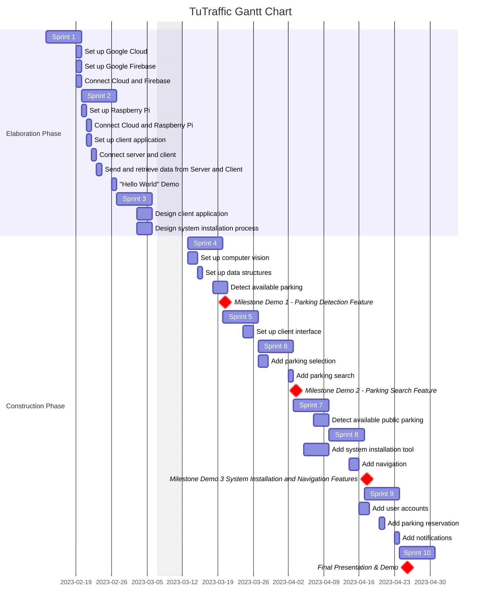

# Schedule

*Figure 1. TuTraffic Gantt Chart*

# Milestones

### Milestone Demo 1
**F**: Object detection and identification
- R: From gathered images
- R: Recognition of cars
- R: Detection accuracy >= 50%

**F**: Detection and identification of parking spaces
- R: From gathered images
- R: Recognition of parking spaces in parking lots
- R: Detection accuracy >= 50%

**F**: Account creation & profile management
- R: Create user account with email and password
- R: Modify user email and password 

### Milestone Demo 2
**F**: Improve object detection and identification of cars
- R: Improve detection accuracy to >= 70%

**F**: Improve object detection and identification of parking spaces in parking lots
- R: Improve detection to >= 70%

**F**: Integration of machine learning algorithms for detection and identification of parking spaces in street
- R: From gathered images
- R: Detection accuracy >= 30%

**F**: Raspberry Pi communication with database
- R: Raspberry Pi camera feed sent to database

**F**: Account modification
- R: Modify user parking preferences

### Milestone Demo 3: 
**F**: Improve object detection of parking spaces in street
- R: Detection accuracy >= 60%

**F**: Raspberry Pi feed processed with computer vision
- R: From images sent to database