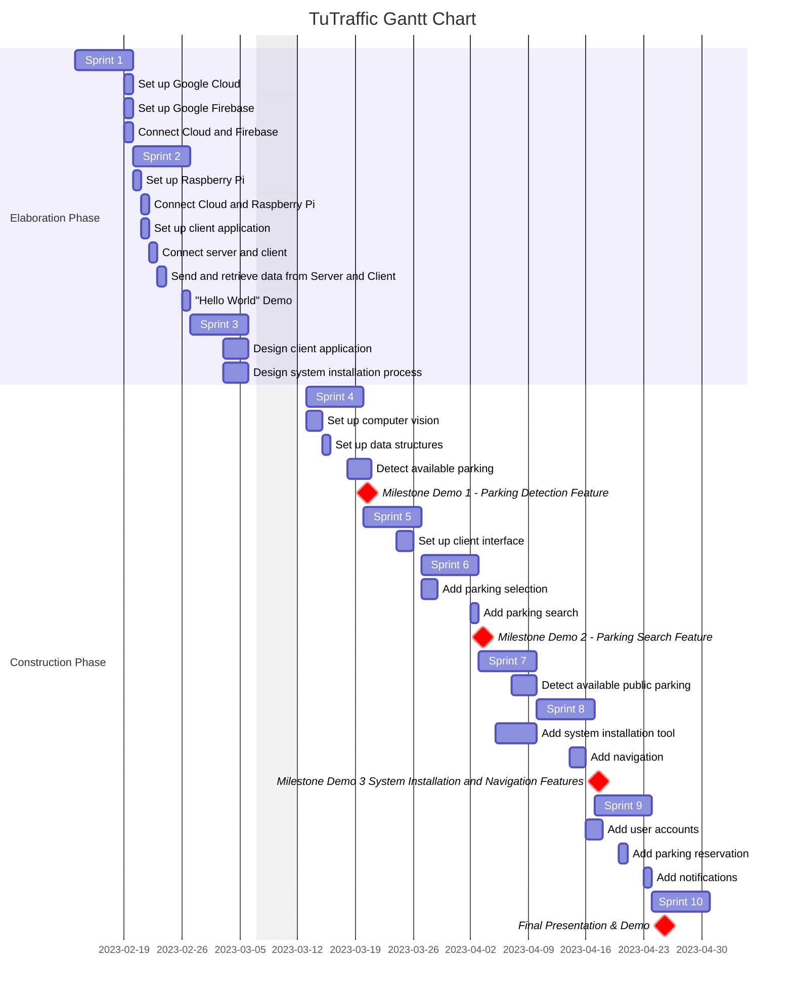

# Schedule

*Figure 1. TuTraffic Gantt Chart*

# Milestones

## Milestone Demo 1
**F1**: Object detection and identification
- R1: The system can recognize cars
	- Test set images will be used for the demonstration.
- R2: The system will be able to detect the absence of a car.
- R3: Detection accuracy >= 30%

**F2**: The system will be able to detect parking spaces.
- R1: The system can detect parking spaces in a parking lot.
	- Test set images will be used for demonstration purposes.
- R2: Detection accuracy >= 30%

**F3**: Account creation & profile management
- R1: Create user account with email and password.
- R2: Modify user email and password. 
- R3: A user should be able to delete their account.

**F4**: Raspberry Pi communication with server
- R1: Raspberry Pi camera feed sent to datastore.
- R2: Raspberry Pi can communicate its existence to the server.

## Milestone Demo 2
**F5**: The system should be able to identify parking spaces and whether they're occupied by a car.
- R1: Integrates F1 and F2 together.
- R2: Machine learning algorithms should also be able to detect street parking.
- R3: Improved accuracy of detection to >= 50%
- R4: Images are sent from Raspberry Pi node and processed.

**F6**: Parking Preferences Consideration
- R1: User can save their preferred parking lot or street.
- R2: user can specify how far they are willing to walk from their parking spot to their destination.
- R3: user can set their vehicle model in their account, preferences, or manually enter their vehicle size, for prefential parking (compact car only spaces, or large vehicle spaces, handicap availabilty) 

**F7**: users should be able to to see parking spaces available.
- R1: the user will be able to see a list of parking spaces nearby.
- R2: the user will be presented with a map view of available parking spaces.

## Milestone Demo 3: 
**F8**: Improve object detection of parking spaces in street
- R1: Detection accuracy >= 70%

**F9**: Notifications of parking space availability
- R1: user should be notified when a parking space that is in their favorites list or a part of their commute routine is taken or available.
- R2: when the user is notified about a parking spot being taken mid commute, the system should suggest an appropriate nearby parking spot.

**F10**: Parking spot, availability radius (Parking Up Ahead)
- R1: the user should be able to see available parking at a specified destination. 
- R2: the radius of the parking available, should be reasonable