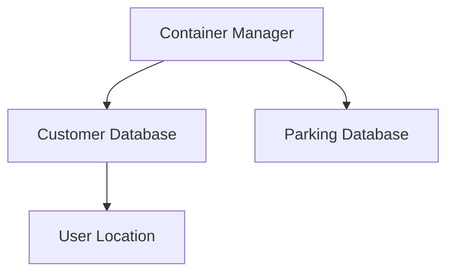
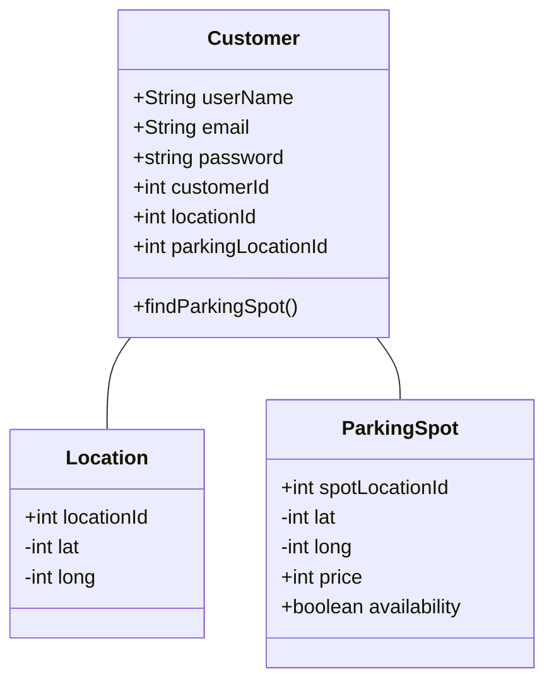
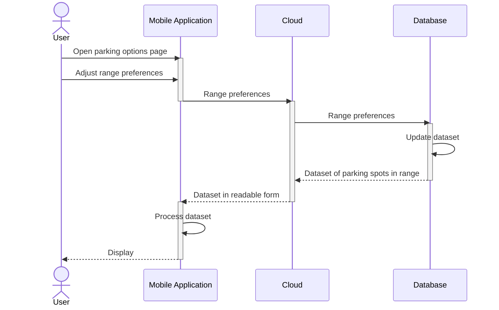
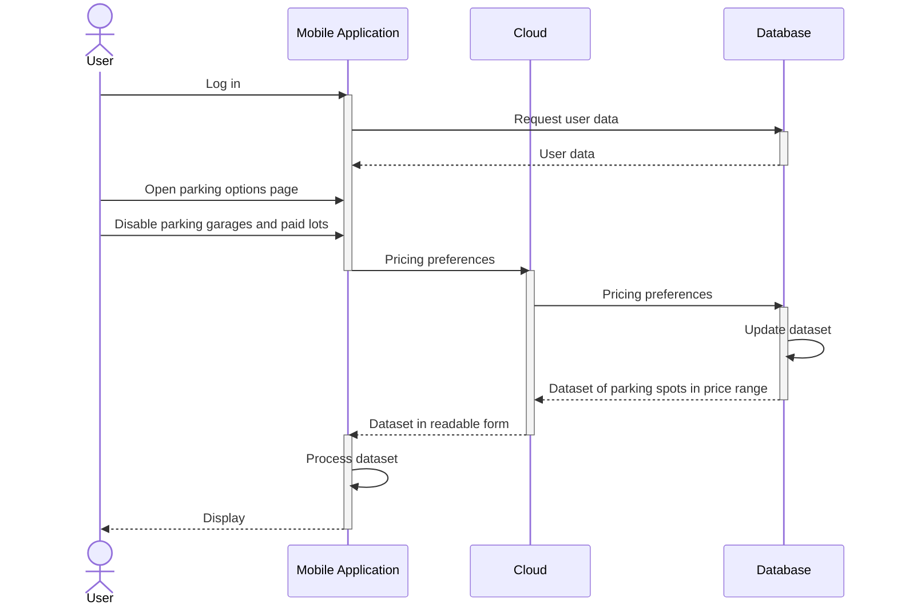
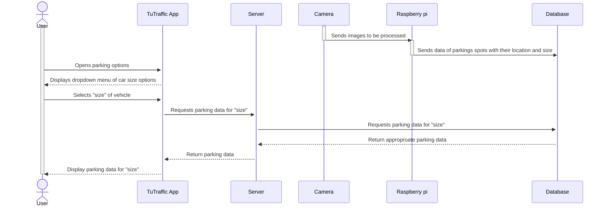
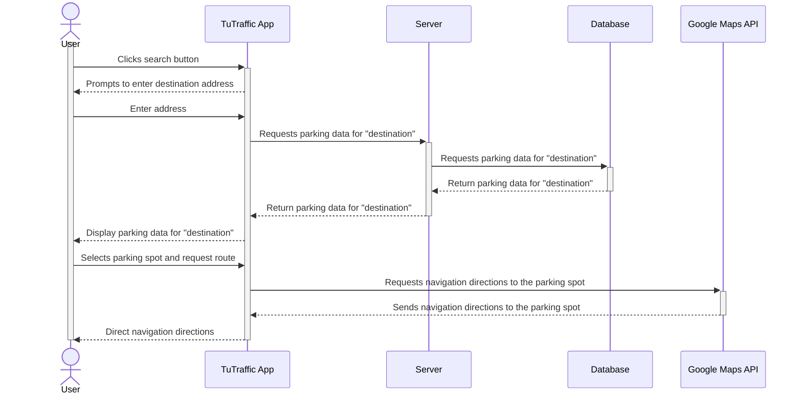
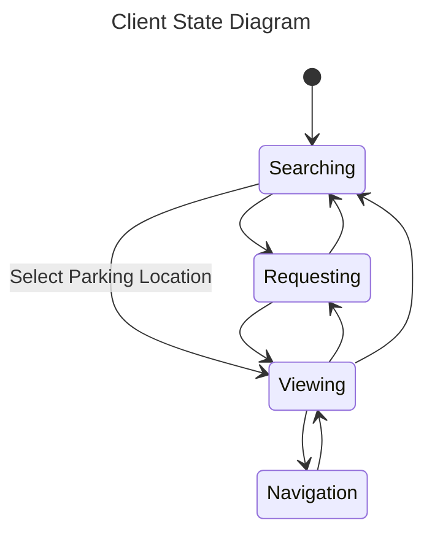
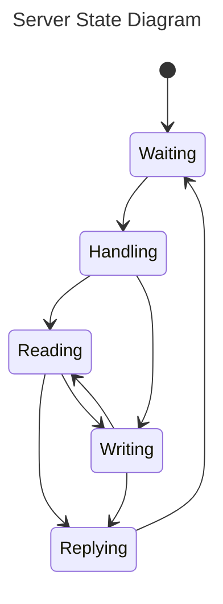
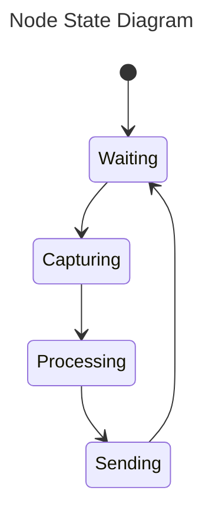
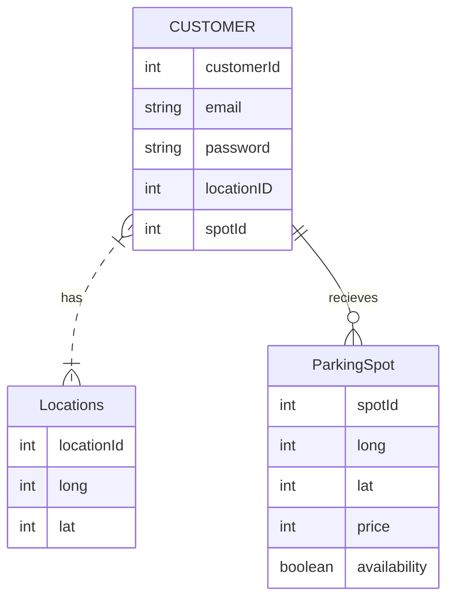

Design
=============================

**Purpose**

The Design Document - Part I Architecture describes the software architecture and how the requirements are mapped into the design. This document will be a combination of diagrams and text that describes what the diagrams are showing.

### Components

**Client**

*Figure. Client Wireframe*

- This is an android application that will require the use of 3 main pages with adjacent xml files and adapters for each view used. 
- The client will be connected to the server via built in functionality within android studio and google cloud. These classes are autogenerated by android studio and are shown as RegisterActivity and DeviceInfoEndpoint respectively. 

**Server**
The server will be hosted in Google Cloud with containers for the Customer database, and Parking database. 

**Database**
- Uses Firebase to save customer information, location and availbe parking spots. 
- Customer table contains CustomerId as the primary key, customer's email and password, and two foreign keys LocationId and ParkingSpotId. 
- Path from CustomerInfo to Location table has LocationId as the primary key and also the user's longitude and latitude. 
- Path from CustomerInfo to ParkingSpot, which had spotLocationId as the primary key and also the parkings spot's longitude, latitude, price and availability. 

### Sequence Diagrams

**Use Case #1**: A user knows their destination and wants to find a spot in its general vicinity.

Use Case 1 Description

1. Upon opening the TuTraffic application, the user opens the *parking options* page, a page that acts as the settings for the users parking preferences and needs.
2. In the *range* subsection of the parking options page, the user can adjust the range of how far they are willing to park in the area surrounding from their destination. 
3. The user clicks *save* and exits the parking options page to return to the home screen.
4. On the home screen, the user can click the *search* button to enter the address of their destination.
5. The TuTraffic application displays a map of the detected spots in the saved range of the destination to the user's device.

**Use Case #2**: A user wants to update their personal parking options to reflect how much they are willing to pay per hour for street parking.

Use Case 2 Description

1. The user logs into their account on the TuTraffic application.
2. The user opens parking options, where their saved preferences are stored.
3. In the *parking type* subsection of the parking options page, the user removes parking garages and paid lots from their preferred list.
4. In the *per hour* subsection of the parking options page, the user edits their accepted hourly price range, reflecting how much they are willing to pay per hour.
5. The user clicks *save* and exits the parking options page to return to the home screen, where only street parking that is less than or equal to their budget will appear on the map.

**Use Case #3**: A user wants to indicate their car size as to only be shown parking spaces that are likely to fit their car.

Use Case 3 Description

1. A logged in user opens the parking options page.
2. In the *car size* subsection of the parking options page, the user selects the option that best reflects the size of their car from a dropdown menu: small, medium, or large.
3. The user clicks *save*.
4. The TuTraffic application sends a message to the server to communicate the unique size need.
5. The server requests this information of parking spots of a particular size to the database.
6. The database, which continuously receives data from the Raspberry Pi node of parking spots and their location and size, sends the appropriate information back to the server.
7. Now, when the user searches for spots, only parking spots that have been detected to likely fit at least their size will appear. 

**Use Case #4**: A user wants be directed to a parking spot after selecting it.

Use Case 4 Description

1. After opening the TuTraffic application, the user clicks the *search* button to find parking spots.
2. The user enters their destination's address.
3. The TuTraffic application displays the detected spots to the user's device.
4. After browsing, the user selects on a parking spot and clicks the *route* button.
5. The Google Maps API is loaded to direct the user to their destination.

### Algorithms

**Computer Vision**

The raspberry pi cameras will have their video feed processed through machine learning's subfield of computer vision in order to detect parking spots. Computer vision is meant to view photo or video feed and replicate the human thought process to make a decision based on what it "sees". TuTraffic's computer vision algorithm will be presented with visual data of both parking spots with painted lines on the ground and street parking that is less defined. This algorithm will then decide if there are any detectable parking spots in the video feed it is processing, how many there are, and where are they. 

Currently, there exists a computer vision algorithm trained to detect parking spots that TuTraffic will likely utilize. TuTraffic may further refine this algorithm to take into account varying car sizes and detect more ambiguous spots on the street that the current algorithm may not be trained to currently see. This would be done by presenting the computer vision algorithm with various datasets that contain such spots to train it.

### State Diagrams

*Figure. Client State Diagram*

The TuTraffic client application experiences multiple states throughout its usage. As depicted in the figure above, its first state is Searching: in this state, the client displays a list of nearby parking spaces, which may be initially empty. The client enters the Viewing state after the user selects a parking location; they can return to the Searching state to view the other locations, or enter the Navigation state. In either the Searching or Viewing State, the client submits requests to the server, such as parking status updates or reservations, in the Requesting state before returning to the previous state. In the Navigation state, the client connects to a third party navigation service and receives real-time driving assistance to help them reach their selected parking location. After the client reaches their destination or ceases navigation, the application returns to the Viewing state.

*Figure. Server State Diagram*

The figure above illustrates the server states of the TuTraffic system. The server starts in the Waiting state; it is idle while there are no jobs to complete. When it receives a request from a client or node, the server proceeds to the Handling state, in which it comprehends the request. Then, the server enters a Reading or Writing state to handle the reading or writing operations, respectively, that are necessary to fulfill the request. For example, a search query is primarily a reading operation, while a parking reservation request is primarily a writing operation. Finally, the server formulates a response, delivers the message in the Replying state, and returns to the Waiting state before the next job.

*Figure. Node State Diagram*

Each Raspberry Pi node in the TuTraffic system begins in the Waiting state, as shown in the above state diagram. The node exits this Waiting state on a regular schedule or upon request, then enters the Capturing state, during which it records an image. The node proceeds to the Processing state, in which computer vision is used to produce a parking location update message. This update is pushed to the server during the Sending state, then the node resumes the Waiting state.

### Database

**Entity-Relation Diagram**

**Table Design**
- Customer Table: This table contain customer information including, email and password. The primary key is customerId. Contains 2 foreign keys locationId and spotID
- Location Table: This table updates in realtime with users longitude and latitude. The primary key is locationId.
- ParkingSpot Table: This table contains the parking spots location, availability and longitude and latitude. Primary key is the spotId
