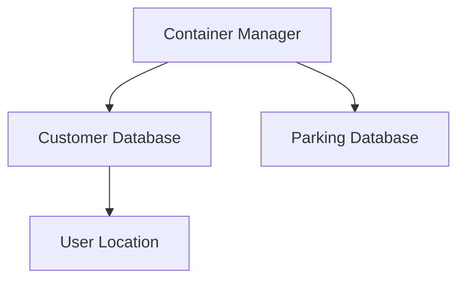
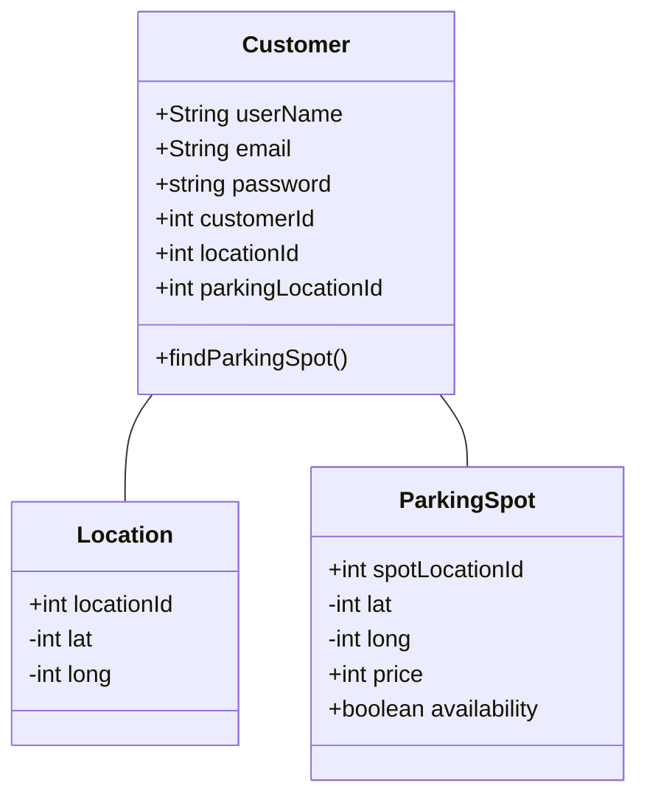
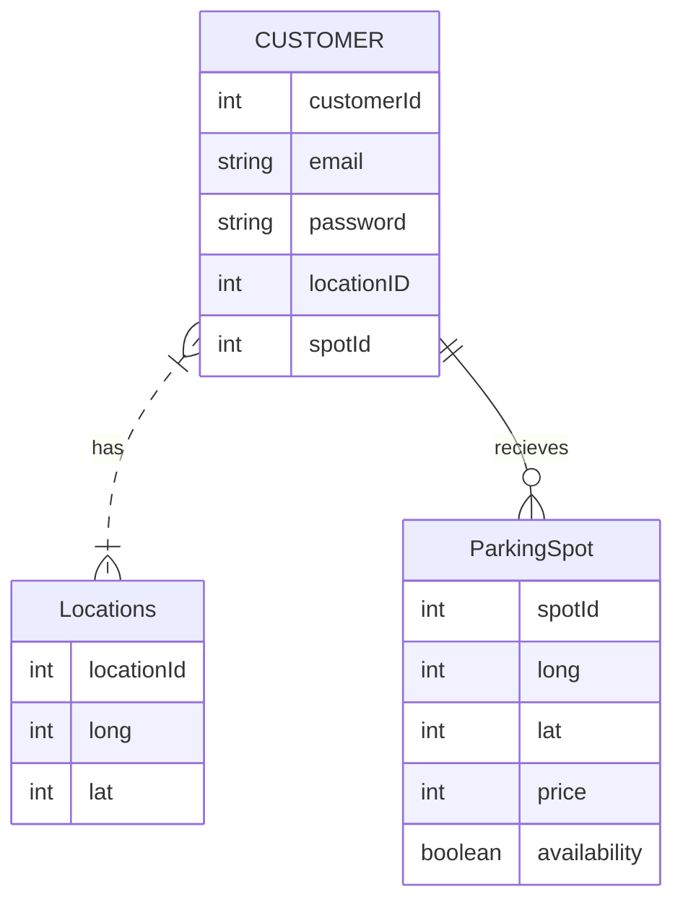

**Purpose**

The Design Document - Part I Architecture describes the software architecture and how the requirements are mapped into the design. This document will be a combination of diagrams and text that describes what the diagrams are showing.

**Requirements**

In addition to the general requirements the Design Document - Part I Architecture will contain:

A description the different components and their interfaces. For example: client, server, database.

For each component provide class diagrams showing the classes to be developed (or used) and their relationship.

Sequence diagrams showing the data flow for _all_ use cases. One sequence diagram corresponds to one use case and different use cases should have different corresponding sequence diagrams.

Describe algorithms employed in your project, e.g. neural network paradigm, training and training data set, etc.

If there is a database:

Entity-relation diagram.

Table design.

A check list for architecture design is attached here [architecture\_design\_checklist.pdf](https://templeu.instructure.com/courses/106563/files/16928870/download?wrap=1 "architecture_design_checklist.pdf")  and should be used as a guidance.

### Components

**Client**

**Server**
The server will be hosted in Google Cloud with containers for the Customer database, and Parking database. 

**Database**
- Uses Firebase to save customer information, location and availbe parking spots. 
- Customer table contains CustomerId as the primary key, customer's email and password, and two foreign keys LocationId and ParkingSpotId. 
- Path from CustomerInfo to Location table has LocationId as the primary key and also the user's longitude and latitude. 
- Path from CustomerInfo to ParkingSpot, which had spotLocationId as the primary key and also the parkings spot's longitude, latitude, price and availability. 

### Sequence Diagrams

**Use Case #1**: User wants to find a spot in a general vicinity.

**Use Case #2**: User wants displayed parking spots to reflect price preferences.

**Use Case #3**: User wants spots that can fit their car to be detected.

**Use Case #4**: User wants be directed to a parking spot.

### Algorithms

**Computer Vision**

### State Diagrams

### Database

**Entity-Relation Diagram**

**Table Design**
- Customer Table: This table contain customer information including, email and password. The primary key is customerId. Contains 2 foreign keys locationId and spotID
- Location Table: This table updates in realtime with users longitude and latitude. The primary key is locationId.
- ParkingSpot Table: This table contains the parking spots location, availability and longitude and latitude. Primary key is the spotId
