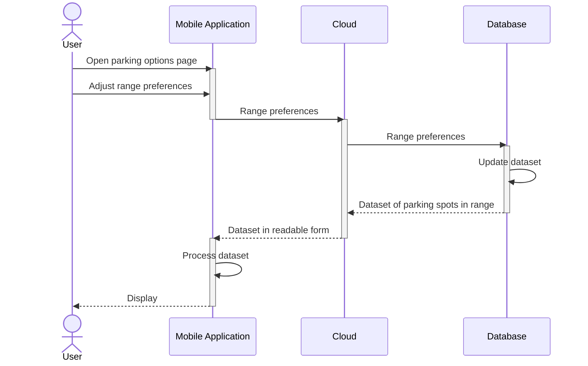
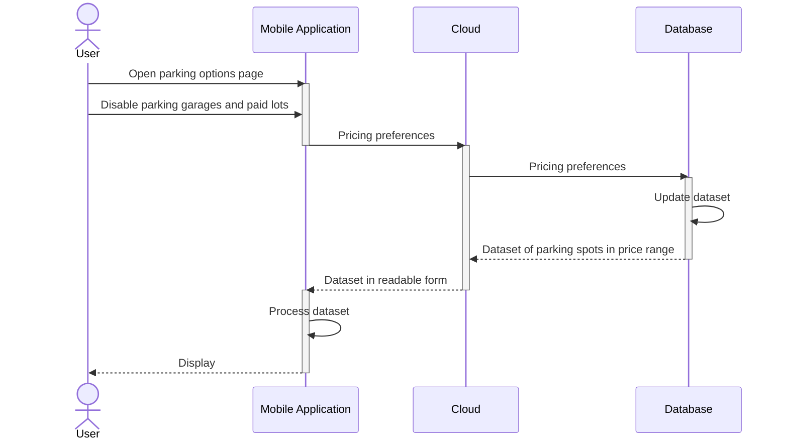

**Purpose**

The Design Document - Part I Architecture describes the software architecture and how the requirements are mapped into the design. This document will be a combination of diagrams and text that describes what the diagrams are showing.

**Requirements**

In addition to the general requirements the Design Document - Part I Architecture will contain:

A description the different components and their interfaces. For example: client, server, database.

For each component provide class diagrams showing the classes to be developed (or used) and their relationship.

Sequence diagrams showing the data flow for _all_ use cases. One sequence diagram corresponds to one use case and different use cases should have different corresponding sequence diagrams.

Describe algorithms employed in your project, e.g. neural network paradigm, training and training data set, etc.

If there is a database:

Entity-relation diagram.

Table design.

A check list for architecture design is attached here [architecture\_design\_checklist.pdf](https://templeu.instructure.com/courses/106563/files/16928870/download?wrap=1 "architecture_design_checklist.pdf")  and should be used as a guidance.

### Components

**Client**

**Server**

**Database**

### Sequence Diagrams

**Use Case #1**: User wants to find a spot in a general vicinity.

**User wants to find a spot in a general vicinity.**
1. User opens parking options.
2. In parking options, user adjusts the range of how far they are willing to park in the area surrounding from their destination. 
3. User clicks the search button to find spots in an area.
4. User enters the address of their destination.
5. The TuTraffic application displays the detected spots in that range to the user's device.

**Use Case #2**: User wants displayed parking spots to reflect price preferences.

## Use Case #2
**User wants displayed parking spots to reflect price preferences.**
1. User opens parking options.
2. In parking options, user removes parking garages and paid lots from their preferences.
3. User edits their accepted hourly price range for street parking in parking options, reflecting how much they are willing to pay per hour.

**Use Case #3**: User wants spots that can fit their car to be detected.

**Use Case #4**: User wants be directed to a parking spot.

### Algorithms

**Computer Vision**

The raspberry pi cameras will have their video feed processed through machine learning's subfield of computer vision in order to detect parking spots. Computer vision is meant to view photo or video feed and replicate the human thought process to make a decision based on what it "sees". TuTraffic's computer vision algorithm will be presented with visual data of both parking spots with painted lines on the ground and street parking that is less defined. This algorithm will then decide if there are any detectable parking spots in the video feed it is processing, how many there are, and where are they. 

Currently, there exists a computer vision algorithm trained to detect parking spots that TuTraffic will likely utilize. TuTraffic may further refine this algorithm to take into account varying car sizes and detect more ambiguous spots on the street that the current algorithm may not be trained to currently see. This would be done by presenting the computer vision algorithm with various datasets that contain such spots to train it.

### State Diagrams

### Database

**Entity-Relation Diagram**

**Table Design**
